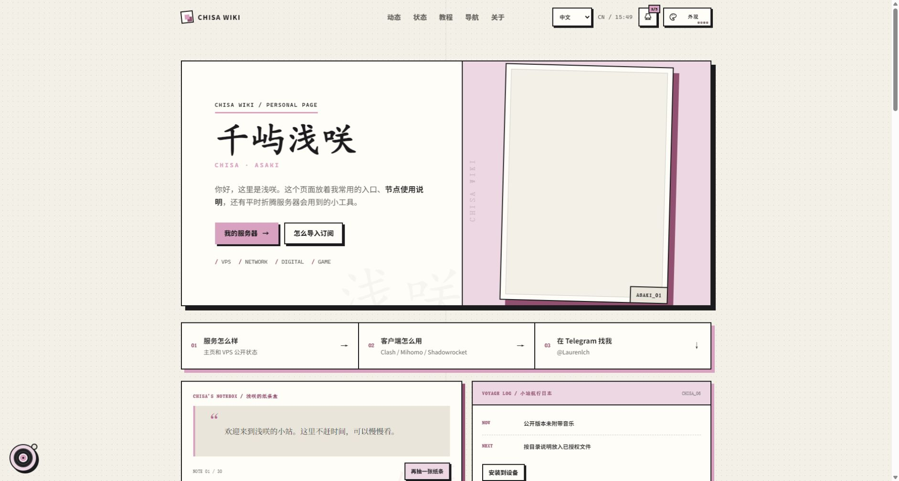
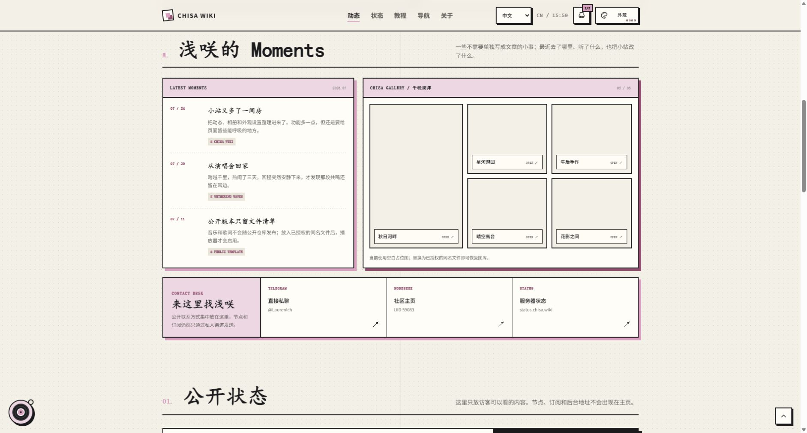
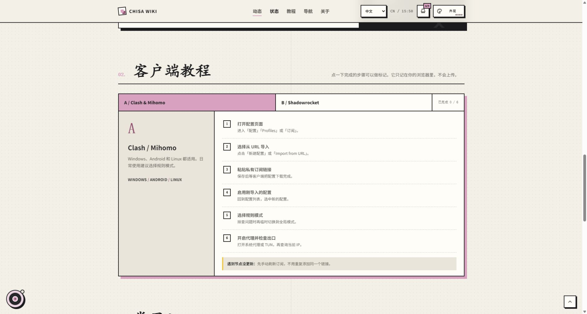

# 千屿浅咲 · Chisa Wiki

一个以浅粉、纸张与手账感为视觉基调的个人主页，用来集中展示浅咲的公开动态、图库、服务器状态、客户端使用说明和常用网络入口。

访问网站：[www.chisa.wiki](https://www.chisa.wiki/)



## 网站内容

- **个人入口**：集中放置服务器状态、客户端教程、Telegram 和 NodeSeek 等公开入口。
- **Moments 与图库**：记录小站更新和近期动态；公开仓库使用空白图库占位图。
- **服务器状态**：提供主页与 VPS 的公开状态入口，同时明确区分公开信息和私有配置。
- **客户端教程**：整理 Clash / Mihomo 与 Shadowrocket 的订阅导入步骤，支持在浏览器中标记进度。
- **常用工具**：按社区、状态和网络分类查找 IP 查询、DNS 检测、网络测速等工具。
- **浅咲电台**：保留播放列表、同步歌词和浮动歌词代码；公开仓库不附带音乐或歌词。

## 页面预览

### Moments 与千咲图库

动态、相册和公开联系方式集中在同一片个人空间中。



### 客户端教程

以分步清单介绍常见代理客户端的订阅导入流程，完成状态仅保存在当前浏览器。



## 特色功能

- 中文 / English 双语界面
- 日间、夜间模式与多套浅粉配色
- 点阵、方格、素纸和花瓣页面底纹
- 访客护照与本地印章收集
- 可交互纸条盒与小站航行日志
- 图库灯箱、工具筛选和关键词搜索
- PWA 安装与 Service Worker 离线缓存
- 响应式布局、键盘操作和无障碍标签
- 所有偏好与教程进度仅保存在本机

## 技术实现

项目采用原生 HTML、CSS 和 JavaScript 构建，没有框架和第三方运行时依赖：

| 文件 / 目录 | 用途 |
| --- | --- |
| `index.html` | 页面结构、内容与语义化标记 |
| `styles.css` | 响应式布局、主题和视觉样式 |
| `app.js` | 多语言、主题、交互、播放器与本地状态 |
| `manifest.webmanifest` | PWA 元数据与快捷入口 |
| `sw.js` | 静态资源缓存和离线访问 |
| `gallery/` | 空白图库占位图与替换说明 |
| `music/`、`lyrics/` | 音乐、歌词文件名和授权要求说明 |
| `icons/` | PWA 图标 |
| `ASSETS.md` | 全部媒体资源的公开发布规则 |
| `COPYRIGHT.md` | 源代码、设计和文档的版权声明 |

## 本地运行

这是一个纯静态网站，使用任意静态文件服务器即可预览。以 Node.js 为例：

```bash
npx serve .
```

启动后打开终端显示的本地地址。也可以使用 Python：

```bash
python -m http.server 8000
```

建议通过 HTTP 服务器访问，而不是直接双击 `index.html`，这样 PWA、Service Worker 和部分浏览器能力才能正常工作。

## 媒体资源与版权

公开版本不分发音乐或歌词，头像和图库文件是无内容的占位图。请阅读 [资源文件说明](ASSETS.md)，只使用原创或已获得公开传播授权的替换资源。

除非另有书面说明，本仓库中的源代码、界面设计和文档保留所有权利，详见 [版权声明](COPYRIGHT.md)。

## 隐私说明

主页只展示适合公开访问的内容。服务器 IP、管理面板、完整订阅链接、节点参数和密钥不会写入页面；主题、语言、教程进度与访客印章等数据保存在访问者自己的浏览器中。

## 协作说明

此项目由 ChatGPT 协助实现。
